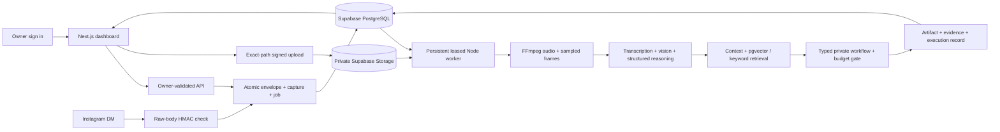

# KDN Brain

An owner-only application that turns captured source text and accessible media into useful private outputs. Version 0.2 continues the original foundation with an implemented manual workflow, provider adapters, transactional worker, authenticated dashboard and usage guide.

**Live status (14 September 2026):** [KDN Brain](https://2nd-brain-phi.vercel.app/) has owner-only Supabase access and an online Railway worker. A real Instagram share was automatically captured. An owned sample video completed actual transcription, sampled visual analysis and a visible script/action. The tested Instagram Reel supplied only a permalink and remains Needs content; arbitrary Reel video access is not verified. Automatic DMs and external actions are off. See the verification guide for exact limits and remaining scope.

## Start here

- **Detailed walkthrough:** [docs/USAGE.md](docs/USAGE.md)
- **Instagram support and uncertainties:** [docs/INSTAGRAM_FEASIBILITY.md](docs/INSTAGRAM_FEASIBILITY.md)
- **Deploy web + worker:** [docs/DEPLOYMENT.md](docs/DEPLOYMENT.md)
- **Verification and remaining work:** [docs/VERIFICATION.md](docs/VERIFICATION.md)

```sh
npm ci
npm run dev
```

Open `http://localhost:3000`, then **Open demo**. Demo data is labelled, local to the browser and removable. AI, media uploads and Instagram do not run in demo mode.

**The current Supabase project already has migrations 001–003 and its owner. Do not rerun or reset it.** For a fresh installation, configure `.env.local` from `.env.example`, inspect the intended Supabase project `dgbrxgkktdqjymjmnrzr`, apply migrations 001 (if not already applied), 002 and 003 in order, create the sole auth user, set OWNER_USER_ID, and run:

```sh
npm run setup:owner
npm run doctor
npm run dev
# A separate terminal or persistent deployed container:
npm run worker
```

Add an OpenAI application API key for paid analysis. A text capture with `/save` is the no-provider reference path. All API requests require a valid Supabase bearer token for the configured owner. Browser table writes and privileged RPC execution are revoked; server policy mediates mutations.

## Implemented

- Owner login, capture form, signed direct-to-private-storage upload, item evidence/coverage, Markdown downloads, retry/resume, project/goal editing, context/pause settings, record export and health.
- Raw-body Meta HMAC verification, bounded request body, atomic envelope/message/capture/job ingestion, sender allow-list, echo filtering and deduplication.
- Persistent worker: non-overlapping loop, renewable leases, bounded attempts/backoff, checkpoints, dead-letter/blocked jobs and guarded atomic completion.
- Real FFmpeg decoding, bounded audio extraction and regular/scene-change frame sampling. OpenAI SDK adapters for timestamped Whisper transcription, structured vision/understanding/artifacts, capped web search and 1536-dimension embeddings.
- Typed private routing to references, assessments, comparisons, scripts, briefs, checklists, experiment proposals and selected project notes. Executed private actions point to actual artifacts; external effects have no executor.
- pgvector retrieval plus keyword fallback, explicit source evidence with timestamps, stored observations and project associations. Ask Brain currently returns keyword-matched records, not a generated personal-memory answer.
- Atomic estimated budget reservations per processing attempt. Daily reset is UTC; costs are not reconciled to invoices.
- No automatic arbitrary-Reel download claim. Shared/unknown URLs retain missing-content status; owner uploads resume the same capture. Source URLs are not scraped.

## Architecture



The web app can run on Vercel; media processing belongs in the separate Node/FFmpeg container. Your laptop need not remain open **after those services are deployed**.

## Tests

```sh
npm run lint
npm run typecheck
npm test
npm run build
npx playwright install chromium
npm run test:e2e
```

`npm test` runs fixture/security tests, real PGlite PostgreSQL-compatible migrations/transactions, actual FFmpeg extraction and a vertical slice with explicitly simulated AI. It is not a live Supabase or Instagram test.

`npm run test:provider` makes actual OpenAI calls using the included original sample video and saves a private script/evidence result. Missing credentials produce an unverified exit code. `npm run sample:video` regenerates the synthetic fixture on macOS using FFmpeg and `say`; the committed video works for tests on Linux too.

## Remaining owner steps for this deployment

1. Add real media or a transcript to a Reel marked Needs content. The tested Instagram payload supplied only a permalink.
2. Review the Railway trial before it expires or runs out of credit; paid continuation requires your own plan decision. Keep the separately funded OpenAI account active.
3. Complete any future Meta business verification/review required for broader account access. Current delivery from the tested owner is verified.

Supabase, Vercel, the Railway worker, the OpenAI service account and the tested Instagram connection are already configured. Do not create duplicate accounts or rerun their initial setup. Today’s paid reservation allowance is full; failed paid work can be retried after the next UTC-day reset (8am Perth). The additional transcript-fallback test is still incomplete.

## Limits

The app is not the complete original 22-section system. OAuth onboarding UI, automated replies, live external tools, paid generation, approval/standing-rule UI, complete retention/deletion, conversational Ask Brain, review/cluster detection, opportunity scoring, full entity graph and authenticated MCP are not implemented. The unused initial-schema tables are not proof those features work. Prototype ideas are not scored as verified demand.

Migrations preserve existing data but 002 deliberately revokes direct browser mutations and closes privileged-function access. Review migration effects before applying to an existing shared project. Worker reservations are estimates and do not implement hard provider billing reconciliation. See the verification matrix for precise test boundaries.
